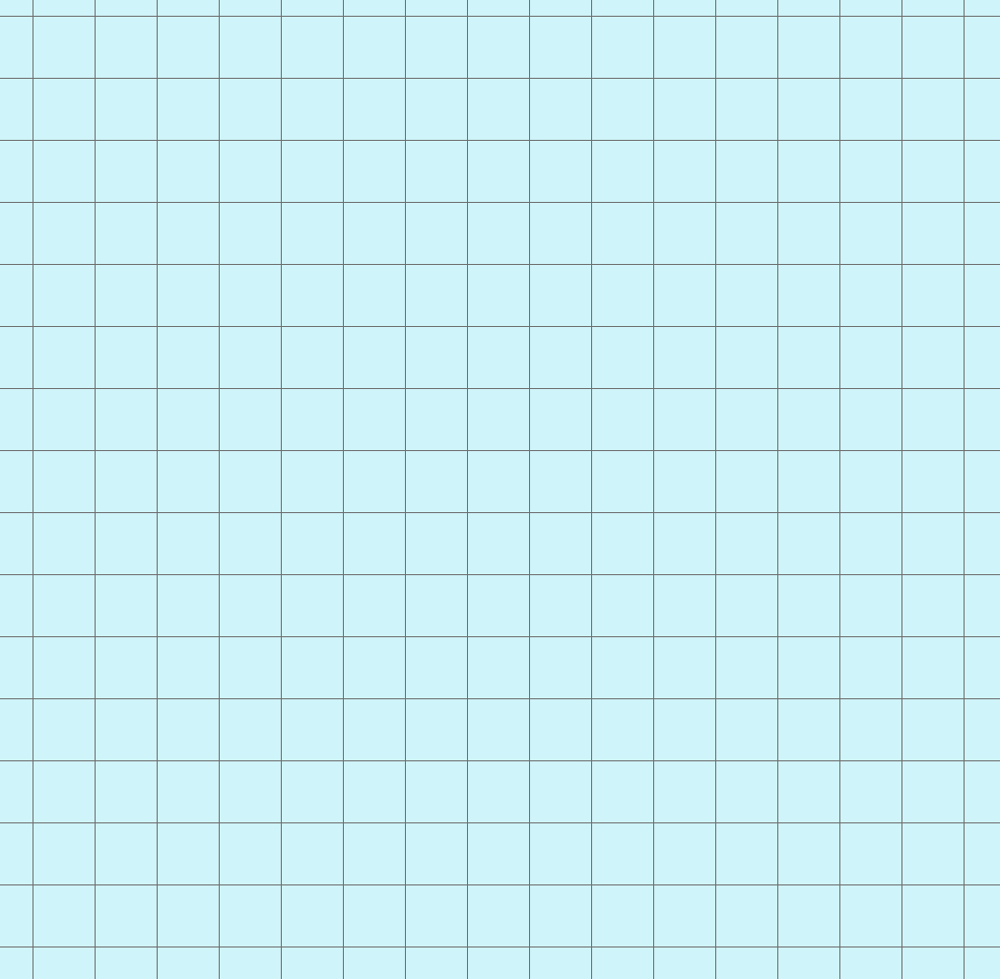
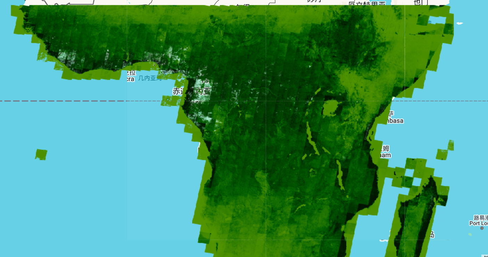
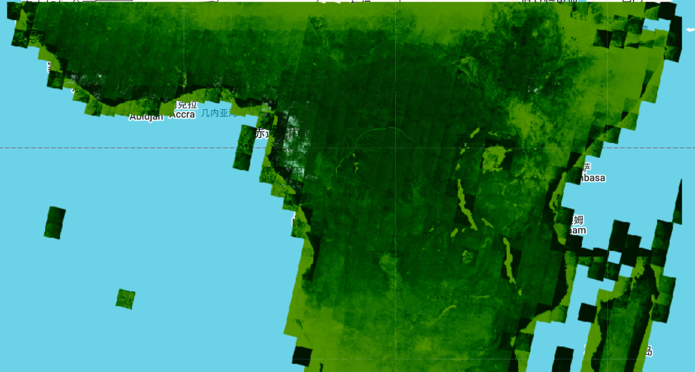
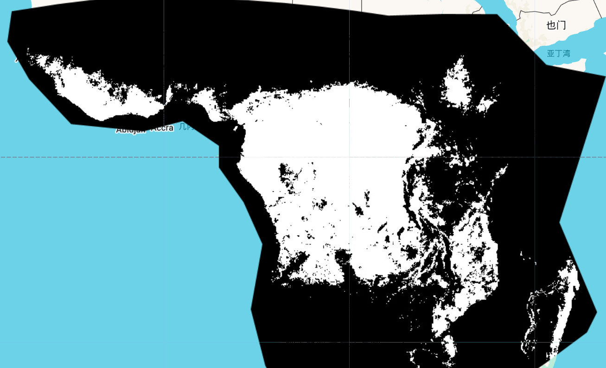
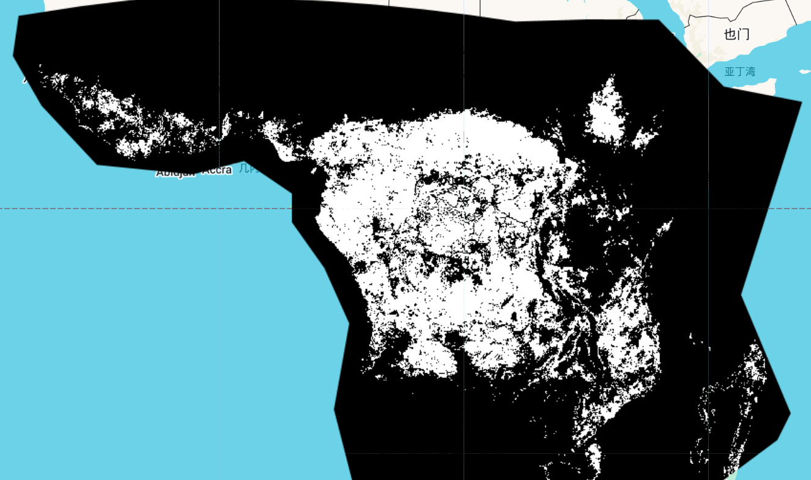

# kNDVI_Analysis
kNDVI Analysis in Google Earth Engine

## **Overview**  
This script calculates the mean kNDVI (kernel NDVI) values for unchanged forest areas 
within a 5km × 5km grid, comparing the years 2000 and 2023. The analysis is conducted 
in Google Earth Engine (GEE) and involves forest masking, 
statistical summarization, and CSV export of results.

---

## **Data Inputs**  

**Region of Interest (ROI):** A predefined polygon specifying the study area.  
**Grid (Fishnet Feature Collection):** A 5km × 5km grid imported as `users/4321hsd/Fishnet`.

  
***Fig1. The study area is 5km×5km grid*** 

**kNDVI Datasets:**   
**2000:** Merged kNDVI image from four sub-regions (kNDVI_P1 to kNDVI_P4).  

  
***Fig2. kNDVI spatial distribution in the study area in 2000***  

**2023:** Merged kNDVI image from four sub-regions (kNDVI_p1 to kNDVI_P4).  

  
***Fig3. kNDVI spatial distribution in the study area in 2023***  

**Forest Cover Data:**
2000 Forest Cover: Extracted from Hansen Global Forest Change (treecover2000).  

  
***Fig4. Spatial distribution of forest with forest coverage greater than 25% in the study area in 2000***  

**Forest Loss (2000-2023):** Extracted from the loss band.  

**2023 Forest Cover:** Derived by masking forest loss from 2000 forest cover.  

  
***Fig5. Spatial distribution of forest with forest coverage greater than 25% in the study area in 2023***  

---
## **Processing Steps**
1.	**Import and Visualization:**
Load ROI polygon and Fishnet grid.
Display kNDVI data for 2000 and 2023 using a custom color palette.
Visualize forest cover for 2000 and 2023.

2. **Forest Masking and kNDVI Processing:**
Identify unchanged forest areas by overlaying 2000 and 2023 forest cover.
Mask kNDVI values to retain only forested areas.
Generate a final kNDVI image with two bands: kNDVI2000 and kNDVI2023.

3. **Statistical Analysis:**
Compute the mean kNDVI for unchanged forest areas within each 5km × 5km grid cell using `reduceRegions()`.

5. **Export Results:**
Save mean kNDVI values per grid cell as a CSV file to Google Drive.

---
## **Expected Outputs**
**CSV File (Mean_kndvi.csv):**  
**Feature ID:** Unique identifier for each 5km × 5km grid cell.  
**kNDVI2000_mean:** Mean kNDVI value within each grid cell for 2000.  
**kNDVI2023_mean:** Mean kNDVI value within each grid cell for 2023.  
The CSV file is stored in the Mean_kndvi folder in Google Drive.

***Tbale1. Forest average kNDVI corresponding to the grid***
| **Id**  | **kNDVI2000**    | **kNDVI2023**    |
|-----|-------------|-------------|
| 34  | 0.5058752   | 0.783572493 |
| 35  | 0.684746576 | 0.995297941 |
| 36  | 0.723229323 | 0.999566821 |
| 37  | 0.864070468 | 0.972653561 |
| 38  | 0.771428063 | 0.917840888 |
| 39  | 0.779388052 | 0.98918571  |
| 40  | 0.651503554 | 0.986997116 |
| 41  | 0.714775309 | 0.993088785 |
| 42  | 0.83637095  | 0.968895209 |
| 43  | 0.944930966 | 0.998436666 |
| 44  | 0.865395733 | 1           |
| 277 | 0.963732962 | 0.999216858 |
| 278 | 0.764659583 | 0.989187935 |
| 279 | 0.63409239  | 0.976846651 |
| 280 | 0.591417714 | 0.945442074 |
| 281 | 0.678964065 | 0.948854587 |
| 282 | 0.699878768 | 0.978599737 |
| 283 | 0.530696822 | 0.968074194 |
| 284 | 0.651359357 | 0.947652467 |
| 285 | 0.587248932 | 0.837698792 |
| 286 | 0.903035911 | 0.998395101 |
| 287 | 0.848157778 | 0.999922555 |
| 288 | 0.959113707 | 0.999957129 |
| 517 | 0.608259204 | 0.767139604 |
| 518 | 0.575328652 | 0.999997635 |

---
## **Notes and Considerations**
**ROI Definition:** The study area polygon can be modified as needed.  
**Grid Resolution:** The analysis is based on a 5km × 5km grid but can be adjusted by replacing the Fishnet dataset.  
**Data Availability:** Ensure that kNDVI assets and the Fishnet grid are uploaded correctly to GEE.  
**Forest Threshold:** Only areas with a tree cover percentage ≥25% are considered as forest.  

---
## **Conclusion**
This script provides an efficient workflow for analyzing kNDVI changes in forested areas over time, leveraging high-resolution spatial analysis in Google Earth Engine. The exported CSV output enables further statistical analysis and interpretation of forest condition trends from 2000 to 2023.

---
## License
Certain implementations within this repository are currently patent-pending.  
Use of this code must comply with the patent clause of the **Apache 2.0 License**.

